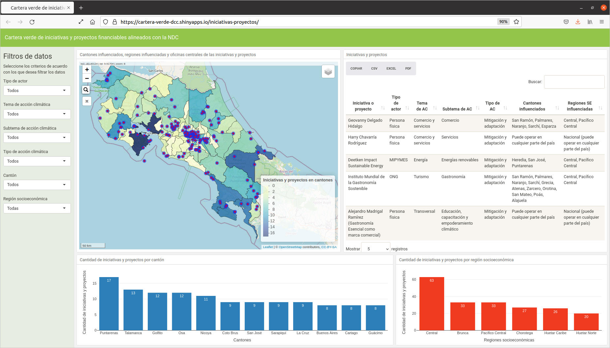

# Aplicación web del proyecto "Elaboración y análisis de una cartera verde de proyectos financiables alineados con la NDC de Costa Rica 2020"
Esta es una aplicación web para consultar y explorar los datos generados por el proyecto "Elaboración y análisis de una cartera verde de proyectos financiables alineados con la NDC (*Nationally Determined Contributions Partnership*) de Costa Rica 2020". Esta cartera se elaboró para la [Dirección de Cambio Climático](https://cambioclimatico.go.cr/). El proyecto fue financiado por el [Programa de las Naciones Unidas para el Desarrollo (PNUD) en Costa Rica](https://www.cr.undp.org/).

La aplicación está disponible en:  
[https://cartera-verde-dcc.shinyapps.io/iniciativas-proyectos/](https://cartera-verde-dcc.shinyapps.io/iniciativas-proyectos/)

La interfaz de usuario de la aplicación está compuesta por un conjunto de mapas, tablas y gráficos interactivos que muestran, entre otros, los siguientes elementos de información relacionados con las iniciativas o proyectos:

- Nombre
- Tipo de actor (municipalidad, ONG, persona física, etc.)
- Cédula
- Coordenadas geográficas (longitud y latitud) de las oficinas centrales
- Cantones en los que tiene influencia
- Regiones socioeconómicas en las que tiene influencia
- Tema de acción climática (energía, industria, transporte, turismo, etc.)
- Subtema de acción climática (aprovechamiento y gestión de residuos, hospedaje, tour operación, etc.)
- Tipo de acción climática (adaptación, mitigación o ambas)

La interfaz permite visualizar, través de mapas y gráficos estadísticos, como está distribuida el área de influencia de las iniciativas y proyectos en los cantones y en las regiones socioeconómicas de Costa Rica. Los datos se presentan también en una tabla que puede ser filtrada, ordenada y exportada a diversos formatos de salida (CSV, Excel y PDF). Además, los datos que presenta la interfaz pueden ser filtrados de acuerdo con los elementos de información mencionados (tipo de actor, tema de acción climática, tipo de acción climática, etc.). La interfaz se muestra en la figura siguiente.



La aplicación fue desarrollada con los paquetes [flexdasboard](https://pkgs.rstudio.com/flexdashboard/) y [Shiny](https://shiny.rstudio.com/) del lenguaje de programación [R](https://www.r-project.org/). Está alojada en la plataforma [shinyapps.io](https://www.shinyapps.io/) de [RStudio](https://www.rstudio.com/). El código fuente y la documentación están disponibles en la plataforma [GitHub](https://github.com/), en la dirección [https://github.com/cartera-verde-dcc](https://github.com/cartera-verde-dcc).

Seguidamente, se detalla el proceso de preparación de los datos de entrada que utiliza la aplicación.

## Preparación de los datos de entrada
La aplicación utiliza tres archivos de entrada:

- `proyectos.csv`
- `cantones.geojson`
- `regiones-socioeconomicas.geojson`

Todos los archivos están almacenados en el subdirectorio `datos/`. Seguidamente, se explica como se procesó cada uno de los archivos.

### proyectos.csv
Se generó a partir de un archivo Excel llamado `datos/PRODUCTO 3 BASE DE DATOS de Proyectos Verdes vNov01.xlsx` (las versiones anteriores de este archivo están en `datos/bak/`). Este archivo Excel proviene de una exportación de los datos de las iniciativas y proyectos, recolectados mediante un formulario Google Forms.

En total, el archivo Excel tiene **200 filas y 121 columnas** de datos. Las siguientes son las columnas que se identificaron como de mayor importancia:

- 05: Nombre de la iniciativa o proyecto
- 06: Tipo de actor
- 07: Cédula
- 31: Latitud
- 32: Longitud
- 40: Regiones socioeconómicas en las que tiene influencia
- 41: Cantones en los que tiene influencia
- 42: Tema de acción climática
- 43: Subtema de acción climática
- 44: Tipo de acción climática

Una parte del procesamiento de este archivo se hizo con el programa LibreOffice Calc y otra parte mediante el lenguaje de programación R.

#### Procedimiento para generar el archivo CSV
- El archivo Excel se abrió en LibreOffice Calc.
- Con la opción de menú **File | Save As...**, el archivo se guardó en formato CSV con el nombre `datos/proyectos.csv` (*Edit Filter Settings = Character set:Unicode(UTF-8) Field delimiter:, String delimiter:" Save content cell as shown*) (las versiones anteriores de este archivo están en `datos/bak/`).
- Se eliminaron las tres primeras filas (estaban en blanco o sin información relevante) y se guardó nuevamente el archivo.
- En la fila 10, columna 32; fila 133, columna 32 y fila 135, columna 32 se cambió una coma por un punto y se guardó nuevamente el archivo.

Para asignar nombres temporales a las 121 columnas, se abrió con un editor de texto el archivo `datos/proyectos.csv` y se insertó al principio la línea:

`c001,c002,c003,c004,c005,c006,c007,c008,c009,c010,c011,c012,c013,c014,c015,c016,c017,c018,c019,c020,c021,c022,c023,c024,c025,c026,c027,c028,c029,c030,c031,c032,c033,c034,c035,c036,c037,c038,c039,c040,c041,c042,c043,c044,c045,c046,c047,c048,c049,c050,c051,c052,c053,c054,c055,c056,c057,c058,c059,c060,c061,c062,c063,c064,c065,c066,c067,c068,c069,c070,c071,c072,c073,c074,c075,c076,c077,c078,c079,c080,c081,c082,c083,c084,c085,c086,c087,c088,c089,c090,c091,c092,c093,c094,c095,c096,c097,c098,c099,c100,c101,c102,c103,c104,c105,c106,c107,c108,c109,c110,c111,c112,c113,c114,c115,c116,c117,c118,c119,c120,c121`

#### Cambios realizados en el código R de la aplicación
- Se renombraron las columnas cuyos datos se muestran en la aplicación.
- Se eliminaron los espacios sobrantes en los nombres de los cantones.
- Se reemplazó "Perez Zeledón" con "Pérez Zeledón".
- Se reemplazó "Talmanca" con "Talamanca".

#### Pendientes
- Monteverde no está en el mapa de cantones del IGN.
- En `datos/proyectos.csv` hay tres filas para `(cedula, nombre)` = `(3002045043, "Asociación Centro Científico Tropical")`.

### cantones.geojson
Es una capa geoespacial, en formato GeoJSON, correspondiente a la división cantonal de Costa Rica. Se generó a partir de la [capa "Límite Cantonal 1:5mil"](https://www.snitcr.go.cr/ico_servicios_ogc_info?k=bm9kbzo6MjY=&nombre=IGN%20Cartograf%C3%ADa%201:5mil) publicada por el Instituto Geográfico Nacional (IGN) en el Sistema Nacional de Información Territorial (SNIT).

Con los siguientes comandos de la biblioteca [GDAL](https://gdal.org/), la capa se simplificó, se validó y se convirtió al sistema de referencia espacial WGS84.

```shell
cd datos

ogr2ogr \
  -simplify 100 \
  -makevalid \
  cantones-simplificadas_100m.geojson \
  WFS:"http://geos.snitcr.go.cr/be/IGN_5/wfs" "IGN_5:limitecantonal_5k" 
```

### regiones-socioeconomicas.geojson
Es otra capa geoespacial generada a partir de la capa "Regiones_mideplan" publicada en el Atlas digital de Costa Rica 2014. Contiene la división de Costa Rica en las regiones definidas por el Ministerio de Planificación (Mideplan) para efectos de investigación y planificación del desarrollo socioeconómico. Fue necesario actualizar la capa de acuerdo con la [versión más reciente](https://documentos.mideplan.go.cr/share/s/eZ8HYuxgTl6xCHx3ZAEBrg), debido a que la del Atlas se encontraba desactualizada.

```shell
cd datos

# Borrado de archivos generados en ejecuciones anteriores
rm regiones-socioeconomicas-simplificadas_100m.geojson

# Archivo temporal
cp regiones-socioeconomicas-atlas2014/regiones_mideplan.* .

# Reubicación de polígonos en las regiones, de acuerdo con la versión más reciente
ogrinfo -dialect sqlite -sql "UPDATE regiones_mideplan SET REGION = 'CENTRAL' WHERE REGION = 'CARTAGO' OR (REGION = 'HEREDIA' AND NCANTON <> 'SARAPIQUI')" regiones_mideplan.shp
ogrinfo -dialect sqlite -sql "UPDATE regiones_mideplan SET REGION = 'HUETAR NORTE' WHERE NCANTON = 'SARAPIQUI'" regiones_mideplan.shp

# Renombramiento de regiones
ogrinfo -dialect sqlite -sql "UPDATE regiones_mideplan SET REGION = 'Brunca' WHERE REGION = 'BRUNCA'" regiones_mideplan.shp
ogrinfo -dialect sqlite -sql "UPDATE regiones_mideplan SET REGION = 'Central' WHERE REGION = 'CENTRAL'" regiones_mideplan.shp
ogrinfo -dialect sqlite -sql "UPDATE regiones_mideplan SET REGION = 'Chorotega' WHERE REGION = 'CHOROTEGA'" regiones_mideplan.shp
ogrinfo -dialect sqlite -sql "UPDATE regiones_mideplan SET REGION = 'Huetar Caribe' WHERE REGION = 'HUETAR ATLANTICA'" regiones_mideplan.shp
ogrinfo -dialect sqlite -sql "UPDATE regiones_mideplan SET REGION = 'Huetar Norte' WHERE REGION = 'HUETAR NORTE'" regiones_mideplan.shp
ogrinfo -dialect sqlite -sql "UPDATE regiones_mideplan SET REGION = 'Pacífico Central' WHERE REGION = 'PACIFICO CENTRAL'" regiones_mideplan.shp

# Unión de polígonos en regiones
ogr2ogr \
  -dialect sqlite -sql "SELECT ST_Union(geometry), REGION region FROM regiones_mideplan WHERE REGION IS NOT NULL GROUP BY REGION" \
  -t_srs EPSG:4326 \
  -simplify 100 \
  -makevalid \
  regiones-socioeconomicas-simplificadas_100m.geojson \
  regiones_mideplan.shp \
  -nln regiones-socioeconomicas

# Borrado del archivo temporal  
rm regiones_mideplan.*
```
